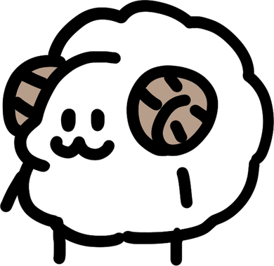
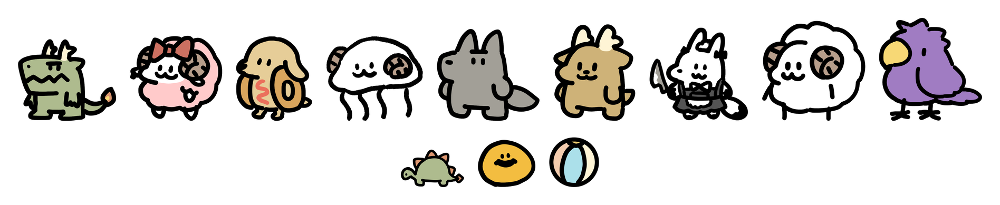

# 熱狗小夥伴 HotDog Pet 🐑

<p align="center"></p>

一群住在 Windows 桌面上的小夥伴。牠們會呼吸、眨眼、看著你的游標，會沿著工作列散步、
踢球、睡覺，還會在你用 Claude Code 的時候陪你一起加班。

<p align="center"></p>

## 動起來長這樣

<video src="https://github.com/speshotdog/clawd-pet/raw/main/docs/demo.mp4" controls width="720"></video>

> 影片沒有自動播放的話，[點這裡看](docs/demo.mp4)。

## 下載

到 [Releases](https://github.com/speshotdog/clawd-pet/releases/latest) 抓
`ClawdPet_x.y.z_x64-setup.exe` 執行就好。缺 WebView2 Runtime 的話安裝時會自動補上，
不需要另外裝任何東西。

## 角色

**熱狗狗狗**、**女僕狐狐**、**膠布**、**玥玥**、**珍珍**、**珍母**、**采華**、**ㄌㄎ**、**羊咩** —— 九隻。

右鍵選單的「主角」可以換目前這隻，「夥伴」可以同時多開好幾隻（甚至同一隻養兩份）。
每隻的身高是照原畫的比例來的，所以站在一起大小才對得起來。

<p align="center"></p>

選單最下面還有一區**隱藏角色**，打勾解鎖後才會回到清單裡 —— 目前放著膠布、玥玥、珍珍的原版造型。

## 功能

### 活著的感覺
- 呼吸起伏、隨機眨眼、視線跟著游標跑
- 你在打字的時候牠會跟著蹦蹦跳
- 摸一下打招呼、雙擊轉圈、抓起來會瞪大眼睛掙扎、放開 Q 彈落地

### 心情與飽食度
- 隨時間慢慢降，互動會回升，關掉重開會記得
- 餓了會垂著眼睛討食；右鍵選單可以餵熱狗 🌭 或餵愛心 ♥（愛心不佔肚子）
- 多隻同時養的時候心情飽食度是共用的，餵哪一隻都算

### 散步與睡覺
- **巡邏模式**：貼著工作列沿螢幕底邊來回走，會左右轉身
- 閒置 90 秒會打瞌睡冒 Zzz，多數角色有專屬的睡姿；玥玥有兩種睡相，偶爾會抽到舊的那張
- 睡著的時候旁邊有清醒的夥伴，有機會被踢醒

### 玩具
小恐龍、黃色球、皮球。丟出去會被寵物追過去踢，球會彈、會滾、會撞牆，也可以直接用滑鼠拖著玩。

### 墓碑事件 🪦
巡邏模式下，**有刀的角色**（女僕狐狐、膠布原版）走近別人時有低機率把對方變成墓碑 ——
墓碑從天上砸下來，停一陣子後原地復活。兩隻有刀的撞在一起就是擲骰對決，誰運氣差誰躺。
選單可以開關，另外有個**殺戮模式**把機率拉到 100%。預設是關的。

### 操作模式 🎮
打開之後可以用 **←/→ 移動主角、空白鍵跳躍**。有按方向就往那邊跳，沒按就原地垂直跳。
開著的時候牠不會自己亂走。

> ⚠ 這個模式下方向鍵是全域生效的 —— 你在別的視窗按方向鍵，牠一樣會跑。所以預設關閉。

### Claude Code 連動
- 你送出訊息 → 牠進入工作模式，頭上出現熱狗醬進度條
- Claude 完成回合 → 轉圈慶祝
- 停在權限確認等你按 → 舉手提醒你
- 連續工作超過 30 秒 → 開始冒汗 💦
- 多個 session 同時跑 → 進度條旁出現 ×N 徽章，每完成一件報數
- 沒有夥伴卻同時來兩件以上工作 → 自動臨時召喚一位分擔，全部完工後自動回家

### 其他
- **大小調整**：迷你／小／標準／大／特大五檔
- **選單可拖曳**：抓標題列就能搬走
- **不擋你做事**：只有角色本體會攔滑鼠，透明的地方完全穿透
- 位置記憶、開機自動啟動、系統匣圖示、多螢幕支援
- 閒置時 CPU 趨近於零，全螢幕遊戲時也不會凍住

## Claude Code hooks 設定

想要連動的話，在 `~/.claude/settings.json` 加上：

```json
{
  "hooks": {
    "UserPromptSubmit": [{ "hooks": [{ "type": "command", "command": "curl.exe -s -m 1 http://127.0.0.1:17872/claude/start >/dev/null 2>&1 || true", "async": true, "timeout": 3 }] }],
    "Stop": [{ "hooks": [{ "type": "command", "command": "curl.exe -s -m 1 http://127.0.0.1:17872/claude/stop >/dev/null 2>&1 || true", "async": true, "timeout": 3 }] }],
    "Notification": [{ "hooks": [{ "type": "command", "command": "curl.exe -s -m 1 http://127.0.0.1:17872/claude/wait >/dev/null 2>&1 || true", "async": true, "timeout": 3 }] }]
  }
}
```

`/claude/*` 只會觸發動畫，不需要驗證，照抄即可。

---

## 開發

<details>
<summary>自己 build（點開）</summary>

### 第一次：一鍵補齊環境

```powershell
npm run setup
```

會逐項偵測並只補缺的：Node.js、Rust (stable-msvc)、VS C++ Build Tools、WebView2 Runtime，
最後跑 `npm install`。已經有的直接跳過。

> 如果它裝了新東西，請開一個**新的**終端機視窗再繼續，否則 PATH 吃不到。

### 之後

```bash
npm run dev      # 開發模式
npm run build    # 打包（NSIS 安裝檔）
```

⚠ 改了 `src/` 底下任何檔案（html / js / css / 圖）都**必須重新 build** ——
前端是在 build 時打包進 exe 的，只把 app 關掉重開看到的還是舊的。

### 控制端點

`/pet/*`（`quit`、`multi`、`char`、`comp`、`murder`、`control`、`parasite`）會改變狀態，
一律要帶 token，否則任何本機程式——包含瀏覽器分頁用一個 `no-cors` 的 `fetch`——
都能關掉你的寵物。token 在第一次啟動時產生並存在 `%LOCALAPPDATA%\com.clawd.pet\token`。

```bash
curl.exe -s "http://127.0.0.1:17872/pet/quit?t=$(cat "$LOCALAPPDATA/com.clawd.pet/token")"
```

只接受 `GET`，路徑要完全相符。

### 技術文件

- [角色製作工法](角色製作工法.md) —— 怎麼把一張插畫變成會動的角色
- [SPEC-v0.4](SPEC-v0.4.md) —— v0.4 的規格書

</details>
