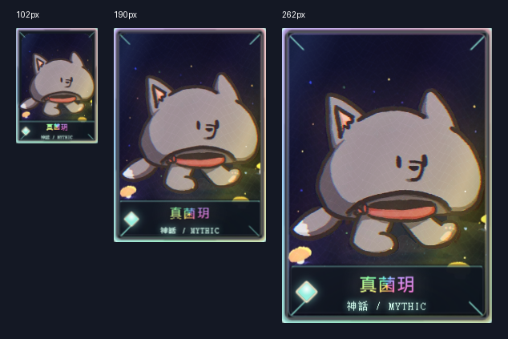
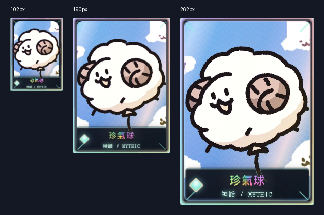
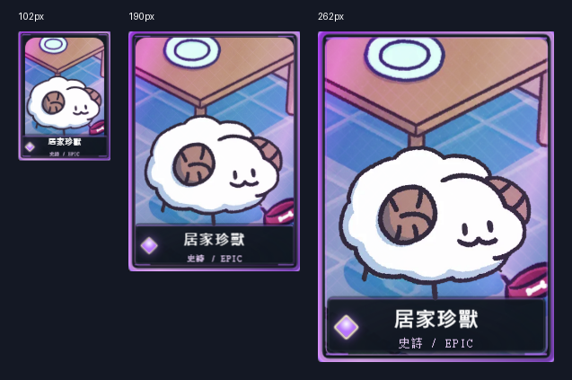
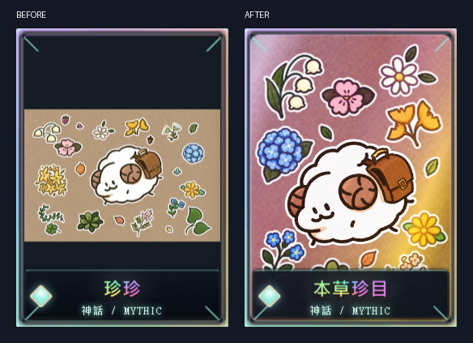
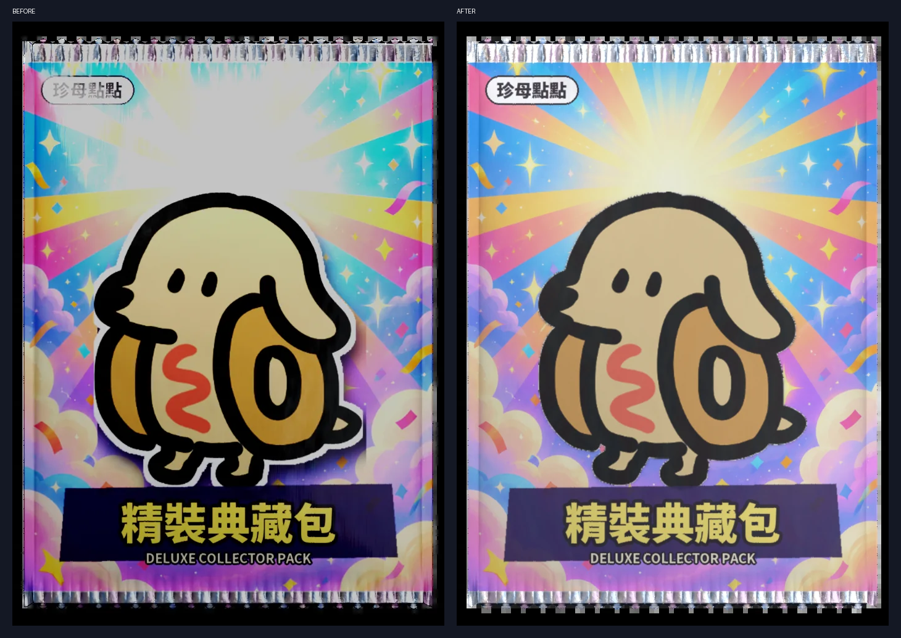
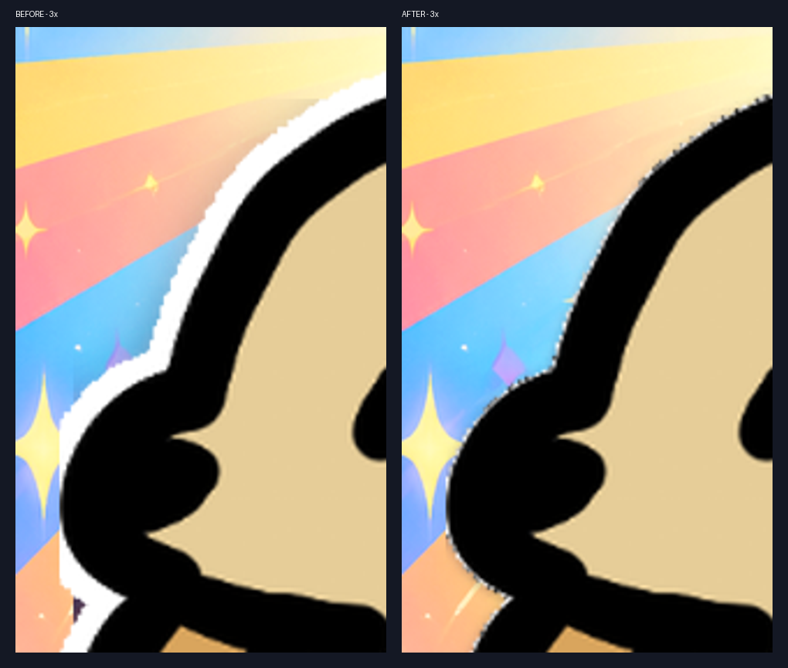

# Round 42 — measured results and deliverables

2026-09-10. Worktree: `D:\claude\clawd-pet-holo`.

Read the four prerequisite documents in the requested order before implementation.
`BRIEF-holo-round42.md` governs this work and overrides HANDOFF section 4.
Implemented A, C and D-1 through D-4. **B: all three cards were already full-bleed; no asset change was needed or made.**
The final round-42 asset, browser and contract checks each exited **0**.
The first asset-check attempt exited **1**; its failed measurement is retained below.
No threshold was relaxed.

## Deliverables

- [Deluxe dev page](../../_art/holo-test/deluxe-gacha-b.html)
- [Deluxe standalone](../../_art/holo-test/deluxe-gacha-b-standalone.html): **4,453,013 bytes**, against **≤6,000,000**.
- [Cards standalone](../../_art/holo-test/cards-remade-standalone.html): **4,471,226 bytes**.
- [Cards dev page](../../_art/holo-test/cards-remade.html)
- Evidence and JSON: [round42](shots/round42/).

Both standalone pages were copied into `shots/round42/portable/` and opened there.
The deluxe builder order was `build_deluxe_b.py` → `build_deluxe_b_standalone.py`.
The standalone builder now reads its already-embedded asset JSON instead of
embedding the identical asset map twice; decoded image data is unchanged by this deduplication.

## A — 沙堡領主

The sheep, castle, flag, shovel and shared contact shadow are in one subject layer.
The separate background is repaired sky/sea-colored horizon and sand. The existing
762×1067 crop/extension registration is shared by both layers, then resized to 600×840.
No card-specific Z values, card geometry or typography were introduced.

| Acceptance | Measured result |
|---|---:|
| Nonzero subject alpha ≥28%, ≤55% | **32.643452%**; before **16.557143%** |
| Sheep/subject contour retained 100% | **4,940/4,940 = 100%**, **0** cropped contour pixels |
| Output background 600×840 | **600×840** |
| Alpha-zero background pixels beneath subject =0 | **0** |
| Sheep/castle background-colored seams at maximum tilt =0 | **0 observed in 8 inspected captures**, four corners × dev/portable |

Contour measurement reference: the largest connected nonzero-alpha component of
the **reviewed generated master cutout before the card crop**. Disconnected generator
dust is excluded from the anatomical contour; the coverage measurement above counts
**every** nonzero alpha pixel in the final layer. This is a crop-retention measurement,
not a claim of pixel-identical RGB extraction from the original illustration.
The sheep and castle share one image and transform, so they have no differential parallax.

[Background only](shots/round42/shabaolingzhu-background-only.png) ·
[Composite](shots/round42/shabaolingzhu-composite.png) ·
[All eight maximum tilts](shots/round42/A-eight-maximum-tilts.png).

## B — already full-bleed, no asset changes

| Card | Background size | Opaque alpha | Alpha-zero pixels | pool kind / scene | Rendered widths |
|---|---:|---:|---:|---|---|
| 真菌玥 | 600×840 | **100%** | **0** | depth / true | **102 / 190 / 262px** |
| 珍氣球 | 600×840 | **100%** | **0** | depth / true | **102 / 190 / 262px** |
| 居家珍獸 | 600×840 | **100%** | **0** | depth / true | **102 / 190 / 262px** |

Actual screenshots inspected: **0 unwanted blank margins, 0 black bars, 0 transparent
checkerboard areas** inside the art windows at all three sizes. Existing card framing
and the translucent nameplate are retained. All **6/6** subject/background SHA-256
hashes equal the initial baseline. No CSS repair was necessary for these cards.







Dev screenshots are also retained under `dev-<id>-sizes.png`.

## C — 本草珍目, stable id zhenzhen

`pool_data.py` is the display-name and card-kind source: `本草珍目`, `mythic`, `depth`,
`scene: True`; id remains `zhenzhen`. The old source filename is explicitly resolved
by id in `prepare_round32.py`, so renaming the display label does not break source lookup.

| Acceptance | Measured result |
|---|---:|
| Full-bleed at 102 / 190 / 262px | Actual widths **102 / 190 / 262** in dev and portable; **0** observed blank margins/black bars |
| Sheep height ≥38%, ≤62% of card height | Alpha bbox y **309–639**, **330/840 = 39.285714%** |
| Background alpha-zero pixels beneath sheep =0 | **0** |
| Complete recognizable botanical stickers ≥6 | **6** large complete stickers above y=640; **0** sheep-overlap pixels for each |
| Display name | **本草珍目**, read from rendered DOM in both entries at all three sizes |
| Rarity remains mythic | Rendered **神話 / MYTHIC** |

The six counted plants are white daisy, lily of the valley, pink flower, ginkgo,
hydrangea and yellow daisy. Extra small leaves and plants behind the nameplate are
not needed to reach six. Their independent component boxes/areas are in
[contract metrics](shots/round42/contract-metrics.json) and the
[annotated background](shots/round42/C-six-complete-plants.png).



[All three sizes](shots/round42/portable-zhenzhen-sizes.png) ·
[Dev comparison](shots/round42/C-before-after-dev.png) ·
[Background only](shots/round42/zhenzhen-background-only.png).

Art provenance: A and C use the built-in imagegen skill for extraction, repair and
portrait recomposition. They are generated derivatives, not original-RGB-preserving
manual cutouts. The original `source-4.0/` files were not modified. Reviewed masters
and prompt descriptions are in [round42-source](../../_art/holo-test/round42-source/README.md).
The initial A candidate had **100% opaque RGB** with a painted checkerboard and was
rejected. The corrected master has actual RGBA. C's import crops only disconnected
alpha 1–7 dust outside the complete sticker region; its final height is measured,
not taken from the prompt's requested percentage.

## D-1 — lighting/material correction

Diagnosis: the existing Blender compositor mapped linear 0.18→0.025 and 1→0.52,
then applied a DARKEN clamp. That crushed shadows and flattened highlights.
The print also has genuinely black ink (print p05 **0**). The narrow bright rim
and glossy coat added broad pale reflections. Merely lifting output gamma would
not correct these causes.

Removed the compositor curve/clamp. Rebalanced wider area lights; print coverage
is **0.97**, specular IOR level **0.15**, coat weight **0.06**, coat roughness **0.42**.
This retains finite substrate reflection under ink and reduces white specular haze.
There is **no post-render brightness, curve or saturation correction**; WebP is encoding only.

Measurement: Rec.709 `0.2126R + 0.7152G + 0.0722B`, 0–255, over pixels with alpha>0.
Transparent canvas is excluded. Saturation is HSV S, averaged over the same valid region.

| Final foil-pack.webp threshold | Before | Final |
|---|---:|---:|
| Mean ≥150, ≤180 | 127.002183 | **151.799562** |
| p05 ≥25 | 0.715200 | **44.647000** |
| p99 ≤250 | 196.719200 | **249.502600** |
| Mean saturation / current pack-print ≥85% | — | **85.197616%** |
| Mean saturation, final / print | — | **0.313967 / 0.368516** |
| Evaluated pack pixels | 608,004 | **607,998** |

The initial unchanged pack had **107.533238%** of the original print's mean saturation:
its apparent haze was not an overall saturation loss by this metric. Local highlight
flattening and darkness were visible in the initial comparison.

Intermediate lighting-only PNG: mean **165.880206**, p05 **64.429200**, p99 **255**.
First encoded asset-check attempt: mean **155.076912**, p05 **60.499000**, p99
**248.274400**, saturation retention **78.261796%**. That check exited **1**;
[its numbers remain here](shots/round42/asset-metrics-attempt1.json).
The final material change above brought retention to **85.197616%** without changing the threshold.



## D-2 — print integration and contour

Removed the added 7px white halo and broad offset shadow. A **2px blur, 28% alpha,
1px vertical offset** contact shadow now integrates the contour with the print.
Defringing recolored **285** near-white source RGB pixels from nearest solid ink;
**0 alpha pixels were removed**. The complete print enters the same Blender material,
so character and background receive the same surface lighting.

| Acceptance | Measured result |
|---|---:|
| Median outer 3px ring/background luminance difference ≥3, ≤12 | **6.470600 gray levels** |
| Ring population | **5,349 pixels** |
| Source alpha removed during defringe | **0** |

Ring definition: original **700×980 print** coordinates, Euclidean distance
`0 < distance ≤ 3` outside the resized subject's alpha≥128 silhouette; each ring pixel
is compared with the nearest adjacent pixel beyond 3px. This measures the print edge
before mesh projection, not a CSS-screen-space ring.
The unchanged print measures **0.000000** under this fixed ring definition because
its wide added white halo occupies both the ring and adjacent samples. Consequently
the baseline scalar alone does not quantify that thick halo's visible hard edge;
the required enlarged pair below shows its removal. No claim that the old baseline
had a large value under this measurement is made.



## D-3 and D-4 — shared foil and deliberate opening

The pack uses the existing `material()` foil DOM/classes and `HoloCardFace.paint()`
cursor mapping. Its fixed material class does not inspect the pending draw. Palette
and glare colors come from the pack's cyan/yellow/pink/purple artwork. Rotation occurs
on an inner surface so the existing outer 220ms exit / 380ms push choreography remains intact.
Displacement **>6px** suppresses the release click, including a drag that returns toward its start.

| Acceptance | Dev | Relocated standalone |
|---|---:|---:|
| 20 drags, each >20px: opens =0 | **0/20**, each **53px** | **0/20**, each **53px** |
| 20 ordinary clicks: opens =20 | **20/20** | **20/20** |
| Reduced-motion: 20 drags / 20 clicks | **0 / 20** opens | **0 / 20** opens |
| Glare/cursor horizontal correlation ≥0.9 | **0.999470603** | **0.999470603** |
| Preopen pixel differences, rare/epic/legendary/mythic versus common =0 | **0 / 0 / 0 / 0** | **0 / 0 / 0 / 0** |
| Return duration, three runtime animation samples | **280 / 280 / 280ms**, mean **280ms** | **280 / 280 / 280ms**, mean **280ms** |
| Rotation during measured drag | **X 6°, Y 12°**, all 3 trials | **X 6°, Y 12°**, all 3 trials |
| Settled transform after 400ms | **identity matrix** | **identity matrix** |
| No-click observation for 4,000ms | **waiting**, **0** opens | **waiting**, **0** opens |
| Page errors / external network requests | **0 / 0** | **0 / 0** |

Glare correlation uses **9 rendered on/off pixel differences**, computing the
luminance-weighted reflection centroid; it does not correlate CSS variables.
Measured centroids move **89.946→231.758px** as pointer x moves **439.84→660.16px**.
Background CSS animations were paused at a common phase for deterministic image comparisons.
Return duration is the runtime Web Animation effect duration, not a claimed GPU frame latency.
Reduced-motion removes the return animation while retaining drag input.
The no-timeout contract is also retained structurally: opening still awaits `packResolve`;
the 4-second observation is not presented as proof of an infinite-duration experiment.

[Material off/on](shots/round42/D3-portable-off-on.png) ·
[Browser measurements](shots/round42/browser-metrics.json) ·
[Timing/contour measurements](shots/round42/contract-metrics.json).

## Actual process exits

Every invoked check script is listed; unsuccessful attempts are not overwritten.
`run_round42_check.py` propagates the child exit code and writes a unique log/JSON pair.

| Check script | Actual exit code(s) | Evidence |
|---|---|---|
| `check_round42_baseline.py` | **0** | [baseline](shots/round42/baseline-metrics.json), [initial exit ledger](shots/round42/initial-exits.json) |
| `check_round42_assets.py` | **1**, then **0** | [failed attempt](shots/round42/asset-metrics-attempt1.json), [final log](shots/round42/1789011162160049300-check_round42_assets.log) |
| `check_round42_browser.py` | **0** | [log](shots/round42/1789011175429890600-check_round42_browser.log) |
| `check_round42_contracts.py` | **0** | [log](shots/round42/1789011381694020500-check_round42_contracts.log) |
| `check_demo_round8.py` | **0** | [log](shots/round42/1789011209587930900-check_demo_round8.log), [retained JSON](shots/round42/retained/verification-round8.json) |
| `check_demo_round9.py` | **0** | [log](shots/round42/1789011209540406400-check_demo_round9.log), [retained JSON](shots/round42/retained/verification-round9.json) |
| `git diff --check` | **0** | Only the ordinary LF→CRLF advisories, no whitespace errors |

Build exits: `fx/build_foil_pack.py` via Blender **0, 0, 0**;
`fx/make_print_layer.py` **0, 0**; `prepare_round42.py` **0, 0**;
`embed_masks.py` **0**; `build_cards_remade.py` **0**;
`build_cards_remade_standalone.py` **0**; `build_deluxe_b.py` **0, 0**;
`build_deluxe_b_standalone.py` **0, 0**.
Final deluxe builder logs:
[dev](shots/round42/1789011170174664500-build_deluxe_b.log),
[standalone](shots/round42/1789011171512421100-build_deluxe_b_standalone.log).

The old demo checks wrote their historical JSON paths; these results were copied
into round42, and the old files restored with their original content and CRLF endings.
They test the retained 65 historical samples; new A/C art is covered by round42's checks.
No claim is made that unrelated historical gift/performance/round32 checks were rerun.

## Rebuild and boundaries

From this worktree, for a complete round42 rebuild:

```text
python _art/holo-test/fx/make_print_layer.py
D:/claude/holo-pack/tools/blender-4.5.13-windows-x64/blender.exe -b -P _art/holo-test/fx/build_foil_pack.py -- D:/claude/clawd-pet-holo/_art/holo-test/fx
python _art/holo-test/prepare_round42.py
python _art/holo-test/embed_masks.py
python _art/holo-test/build_cards_remade.py
python _art/holo-test/build_cards_remade_standalone.py
python _art/holo-test/build_deluxe_b.py
python _art/holo-test/build_deluxe_b_standalone.py
```

Use `prepare_round42.py` for this artwork; `prepare_round40.py` is the superseded
castle-only art preparation. The checked-in generated masters allow rebuilding
without contacting imagegen again. Blender is an existing read-only tool outside
the worktree; all render destinations are inside this worktree.

**No commit and no push.** Git's metadata resolves to
`D:/claude/clawd-pet/.git/worktrees/clawd-pet-holo`, outside the writable boundary.
Commit was skipped rather than requesting escalation. The initial plain `git status`
encountered dubious ownership; subsequent read-only Git commands used a per-command
`-c safe.directory=...`, without changing global configuration.

Review/commit boundaries:

1. Data: `pool_data.py`, stable source lookup in `prepare_round32.py`.
2. Art: `round42-source/`, `prepare_round42.py`, A/C subject/background layers.
3. Pack pipeline: the two `fx/` builders and print/pack/tear PNG/WebP outputs.
4. Interaction/material: `ceremony.js`, `ceremony.css`.
5. Portable asset-map deduplication: `build_deluxe_b_standalone.py`.
6. Generated outputs: cards/dev/standalone and deluxe/dev/standalone; `demo.html`
   changed only for rebaked alpha mask data.
7. Tests, this report, and selected round42 evidence.

`src/` and `card_face.js`: **0 changed files** in the frozen-path Git diff (exit **0**).
RATE remains **0.005 / 0.04 / 0.15 / 0.40 / 0.405** and initial tickets remain **30**;
unlimited mode remains **false**. Gift files and original source art were untouched.
Largest round42 PNG evidence file: **1,308,056 bytes**; **0** screenshot PNGs exceed 2MB.
Portable HTML copies, discarded candidates and Blender project intermediates are ignored
under `shots/round42/.gitignore`. No files were staged.
