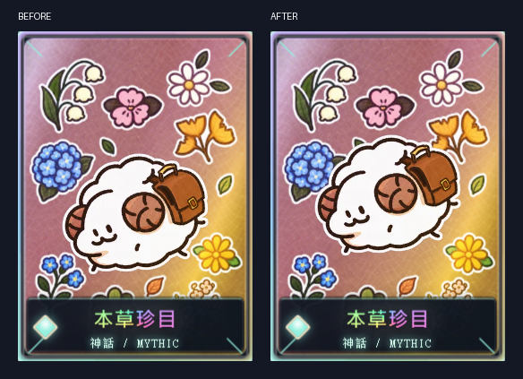
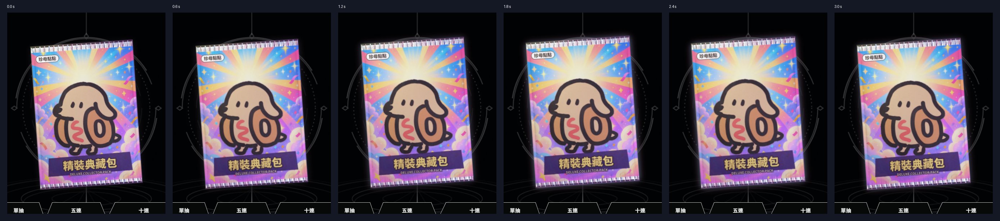
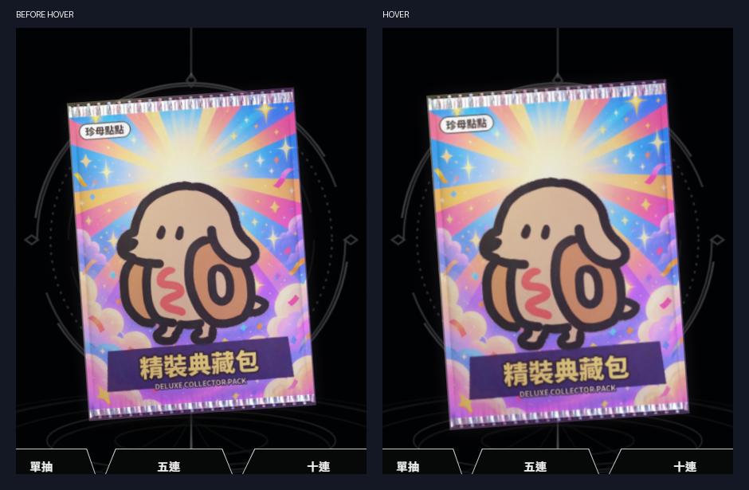

# Round 43 ? measured results; stopped at Task A height conflict

2026-09-10 ? `D:\claude\clawd-pet-holo`

**This round is not fully accepted.** Task A moves the sheep upward without resizing, but its rendered height remains below the brief?s **37.8%** minimum. Final dev measurements are **37.326557?37.329374%**; relocated standalone measurements are **37.649731?37.652572%**. The actual portable before image measures **37.649727%**. No size or threshold was changed to hide the conflict. Implementation changes stopped when the conflict was identified; verification, evidence retention, and this report were completed.

Task B meets the listed numerical thresholds in both dev and relocated standalone. The final new check nevertheless exits **1**, because it also asserts all six Task A height measurements. The required round-32 check exits **1** for one historical `pool_data.py` byte-snapshot mismatch, not an import error.

Read first: `LESSONS-2026-09-09.md`, `HANDOFF-2026-09-10.md` including section 3, and `REPORT-holo-round42.md`. Also checked the frozen card construction rules. The separate gacha layout/planning track was not implemented.

## Deliverables

- [Deluxe dev](../../_art/holo-test/deluxe-gacha-b.html) and [Deluxe standalone](../../_art/holo-test/deluxe-gacha-b-standalone.html).
- [Cards dev](../../_art/holo-test/cards-remade.html) and [Cards standalone](../../_art/holo-test/cards-remade-standalone.html).
- [Task A before/after, same 262px card](shots/round43/A-portable-before-after.png).
- [Task A 102 / 190 / 262px](shots/round43/A-portable-sizes.png); [dev sizes](shots/round43/A-dev-sizes.png).
- [Task B six idle samples over three seconds](shots/round43/B-portable-idle-six-frames.png).
- [Task B hover before/after](shots/round43/B-portable-hover-before-after.png).
- [Final detailed measurements](shots/round43/idle-metrics.json), [exit ledger](shots/round43/exit-ledger.json), [boundary audit](shots/round43/boundaries.json).

Standalone copies were opened from `shots/round43/portable/`. That folder contains self-contained before/final HTML copies and is ignored. No asset lookup changes were needed; `pool_data.SOURCE_STEM` and both source resolvers were left untouched.

## A ? ???? / stable id `zhenzhen`

`card-position.css` translates `.art-media` upward by 6% of its own height. Both builders embed that one shared rule. The original sheep image, its registered foil mask, and any shadow pixels in that layer move together. No image was regenerated, resampled, or scaled; no card Z, text geometry, or background image was changed.

The table uses nonzero alpha bounds of the **actual decoded image in each entry**, mapped through the neutral rendered image rect into the card rect. Dev uses the 600?840 PNG, bbox `(101,309,499,639)`; portable uses the embedded 420?588 image, bbox `(70,215,350,448)`. This retains the brief?s card-height denominator. The old asset-only measurement, **330/840 = 39.285714%**, is not substituted for rendered sheep height.

| Entry / card width | Center: 48?53% | Gap to nameplate: 7?14% | Height: 37.8?39.8% | Name overflow |
|---|---:|---:|---:|---:|
| dev / 102px | 49.608356% | 12.544273% | **37.329374% ? below minimum** | 0px |
| dev / 190px | 49.608261% | 12.541369% | **37.328074% ? below minimum** | 0px |
| dev / 262px | 49.608394% | 12.536601% | **37.326557% ? below minimum** | 0px |
| portable / 102px | 49.559876% | 12.431154% | **37.652572% ? below minimum** | 0px |
| portable / 190px | 49.559783% | 12.428254% | **37.651261% ? below minimum** | 0px |
| portable / 262px | 49.559918% | 12.423490% | **37.649731% ? below minimum** | 0px |

Actual portable 262px baseline: center **55.260700%**, gap **6.722710%**, height **37.649727%**. After: center **49.559918%**, gap **12.423490%**, height **37.649731%**. The ~0.000003 percentage-point height difference is DOM floating-point rounding; the image and scale are identical.

| Other A requirement | Measured / inspected result |
|---|---|
| Alpha-zero background pixels under the moved subject = 0 | **0** across the entire **600?840 = 504,000px** background, therefore also 0 under the silhouette |
| 102 / 190 / 262px evidence | **102 / 190 / 262px** actual layout widths in both entries; **6** final captures |
| Full bleed / clear name | **0** observed blank margins or black bars; **0** name-overflow pixels; name **????** remains visible in all 6 captures |
| Old-position repair / detached shadow | **0** obvious ghosts or detached contact shadows observed in the pair and background-only image; paper texture continues into the newly exposed region |

**Additional limitation: plant overlap.** The old round-42 contract checker examines unchanged raw PNGs, so it reports 6 large plants and zero source-layer overlap. It does not account for the new CSS position. A separate diagnostic translates the alpha by 50 asset pixels (the 50.4px CSS-equivalent offset rounded to an integer) and finds **1,122px** overlap at the ginkgo sticker and **1,496px** at the hydrangea; the other four measured components have **0px** overlap. This is an asset-coordinate diagnostic, not an exact screen-space raster count. I do not claim that all six stickers remain completely unoccluded. This is another reason the candidate is not accepted. [Diagnostic](shots/round43/botanical-overlap-diagnostic.json).



## B-1 through B-4 ? pack idle and hover

The outer entry-pack element retains the existing push/open choreography. Nested elements separately own hover scale, float translation, breathing scale, and the existing drag rotation. The glow is a sibling behind the pack surface, colored cyan `#52cbe9` and pink `#ef89bf` from the pack palette. It does not inspect the pending draw. Float/breath use CSS transforms, glow uses CSS opacity over a static drop-shadow filter, and no rAF loop was added.

| Acceptance | Dev | Relocated standalone |
|---|---:|---:|
| Hover width ratio 1.03?1.08? | 1.054999767? | 1.054999767? |
| Hover enter 120?200ms / leave 160?260ms | **160 / 220ms**, ease-out | **160 / 220ms**, ease-out |
| Float travel 4?10px | 8.000px peak-to-peak; half-amplitude 4px | 8.000px peak-to-peak; half-amplitude 4px |
| Float period 2.8?4.5s | 3.600000s | 3.600000s |
| Descending midline crossings | 900, 4500ms (3.6s apart) | 900, 4500ms (3.6s apart) |
| Breathing scale 1.000?1.025? | 1.000?1.018? | 1.000?1.018? |
| Breathing period | 4.800000s | 4.800000s |
| Breath / float ratio outside 0.95?1.05 | 1.333333333 | 1.333333333 |
| Float / breath easing must be non-linear | **ease-in-out / ease-in-out** | **ease-in-out / ease-in-out** |
| Glow period 3?6s | 4.200s | 4.200s |
| Glow seam maximum difference ?2 gray levels | 0 (maximum RGB-channel difference) | 0 (maximum RGB-channel difference) |
| Glow outer-ring mean luminance increase 8?28 | 21.493727 gray levels | 21.493727 gray levels |
| Measured outer 12px ring population | 16,975 pixels | 16,975 pixels |
| Preopen differing pixels: rare / epic / legendary / mythic vs common = 0 | 0 / 0 / 0 / 0 | 0 / 0 / 0 / 0 |
| Drag rotation preserved at +60 / ?30px | rotateX(6deg) rotateY(12deg) | rotateX(6deg) rotateY(12deg) |
| During drag: hover scale applied once | 1.055000? | 1.055000? |
| normal motion: 20 drags ? 0 opens; 20 clicks ? 20 opens | 0/20 drag opens; 20/20 click opens | 0/20 drag opens; 20/20 click opens |
| reduced motion: 20 drags ? 0 opens; 20 clicks ? 20 opens | 0/20 drag opens; 20/20 click opens | 0/20 drag opens; 20/20 click opens |
| Drag distance in input trials | **53px** each | **53px** each |
| Post-push waiting: x/y/width/height changes = 0 | 0px / 0px / 0px / 0px | 0px / 0px / 0px / 0px |
| Post-push idle animation count = 0 | 0 | 0 |
| idleRaf = 0 (existing ceremony state counter) | 0 | 0 |
| Reduced motion: x/y/width/height changes = 0 | 0px / 0px / 0px / 0px | 0px / 0px / 0px / 0px |
| Reduced-motion idle animation count = 0 | 0 | 0 |
| Reduced-motion static glow opacity | 0.35 | 0.35 |
| Reduced-motion hover retained, 1.03?1.08? | 1.055000023? | 1.055000023? |
| Page errors | 0 | 0 |

Motion measurement pauses CSS animations and samples two complete periods, with 72 subdivisions per period; extrema and recurring midline crossings are recorded. Hover uses 20 successive double-rAF rendering barriers and `getBoundingClientRect()` width samples. The screenshot strip uses **0 / 600 / 1200 / 1800 / 2400 / 3000ms**.

Glow measurement freezes float/breath and background at the same phase. Chromium rasterizes a white alpha silhouette of the actual rotated/clipped pack; the ring is the Euclidean area **0 < distance ?12 screen pixels** outside its ?128 raster mask. Rec.709 luminance compares the 0ms trough with the 2100ms peak. The seam compares 0ms and 4200ms with all other animations held fixed. The six-frame strip instead advances all three idle effects together.

Native lifecycle/input tests reload the page after deterministic WAAPI sampling, so test-paused animations cannot survive CSS removal and contaminate the native result. Waiting snapshots are taken after 500ms and another 500ms apart. Reduced-motion snapshots are 500ms apart; hover feedback is then measured separately.





## Mandatory regression measurements

`check_round42_assets.py` returned **0 / 0**; `check_round42_contracts.py` returned **0 / 0 / 0**. Their final complete measurements are retained in [assets](shots/round43/check_round42_assets-metrics.json) and [contracts](shots/round43/check_round42_contracts-metrics.json).

| Existing threshold / contract | Rerun measurement |
|---|---:|
| Castle subject coverage 28?55% | **32.643452%** |
| Sheep asset height 38?62% (asset coordinates, not round-43 rendered height) | **39.285714%** |
| Castle / sheep background alpha holes = 0 | **0 / 0** |
| Pack mean luminance 150?180 | **151.799562** |
| Pack p05 ?25 | **44.647000** |
| Pack p99 ?250 | **249.502600** |
| Pack saturation retention ?85% | **85.197616%** |
| Print outer 3px median contrast 3?12 | **6.470600**, **5,349px** ring |
| Castle contour retention 100% | **4,940 / 4,940 = 100%**, **0** cropped |
| Six botanical components, raw asset overlap = 0 | **6**; **0 / 0 / 0 / 0 / 0 / 0**; see CSS-position limitation above |
| Unchanged other-card layer hashes | **6 / 6** equal |
| Deluxe standalone ?6,000,000 bytes | **4,454,903** |
| Frozen src / card_face diff | **0** changed files, git exit **0** |
| Drag return duration | **280 / 280 / 280ms** in each entry |
| Drag angles | **X 6?, Y 12?**, three trials per entry |
| Settled drag transform | **identity** in both entries |
| 4,000ms no-click observation | **0** opens, phase **waiting**, both entries |

`check_new_cards_round32.py` completed **1,544** assertions with **1** failure. Source resolution/import succeeded from the repository?s `source-4.0/`. The sole failed assertion is `frozen source/card_face/ceremony bytes`: **1** differing path against its historical snapshot, `_art/holo-test/pool_data.py`. This file has **0** worktree diff this round; the old snapshot was not updated. All individual assertion inputs/results, numeric geometry, asset values, and natural-reveal states are preserved in [all 1,544 records](shots/round43/retained/round33/acceptance.json). No fixture, RATE, or ticket adjustment was used to make the result green.

## Actual exits and retained unsuccessful attempts

| Entry point | Real exit | Log |
|---|---:|---|
| `build_cards_remade.py` | **0** | [1789013483454802200-build_cards_remade.log](shots/round43/1789013483454802200-build_cards_remade.log) |
| `build_cards_remade_standalone.py` | **0** | [1789013483686571500-build_cards_remade_standalone.log](shots/round43/1789013483686571500-build_cards_remade_standalone.log) |
| `build_deluxe_b.py` | **0** | [1789013487182342600-build_deluxe_b.log](shots/round43/1789013487182342600-build_deluxe_b.log) |
| `build_deluxe_b_standalone.py` | **0** | [1789013487402736000-build_deluxe_b_standalone.log](shots/round43/1789013487402736000-build_deluxe_b_standalone.log) |
| `check_round43_idle.py` | **1** | [1789013563982593800-check_round43_idle.log](shots/round43/1789013563982593800-check_round43_idle.log) |
| `check_round42_assets.py` | **0** | [1789013579583529500-check_round42_assets.log](shots/round43/1789013579583529500-check_round42_assets.log) |
| `check_round42_contracts.py` | **0** | [1789013581804621500-check_round42_contracts.log](shots/round43/1789013581804621500-check_round42_contracts.log) |
| `check_new_cards_round32.py` | **1** | [1789013620859547800-check_new_cards_round32.log](shots/round43/1789013620859547800-check_new_cards_round32.log) |
| `build_deluxe_b.py` | **0** | [1789013689625722300-build_deluxe_b.log](shots/round43/1789013689625722300-build_deluxe_b.log) |
| `build_deluxe_b_standalone.py` | **0** | [1789013689859381500-build_deluxe_b_standalone.log](shots/round43/1789013689859381500-build_deluxe_b_standalone.log) |
| `check_round43_idle.py` | **1** | [1789013707367190600-check_round43_idle.log](shots/round43/1789013707367190600-check_round43_idle.log) |
| `check_round42_assets.py` | **0** | [1789013746521254900-check_round42_assets.log](shots/round43/1789013746521254900-check_round42_assets.log) |
| `check_round42_contracts.py` | **0** | [1789013749928883300-check_round42_contracts.log](shots/round43/1789013749928883300-check_round42_contracts.log) |
| `check_round43_idle.py` | **1** | [1789013885107996200-check_round43_idle.log](shots/round43/1789013885107996200-check_round43_idle.log) |
| `check_round42_contracts.py` | **0** | [1789014096924245300-check_round42_contracts.log](shots/round43/1789014096924245300-check_round42_contracts.log) |

The first idle check returned **1**: glow **35.782259** exceeded 28; WAAPI-owned test animations produced counts of **3** in waiting/reduced mode; A height was below minimum. The glow peak opacity was reduced from **0.65 to 0.42**; no threshold changed. The test lifecycle was corrected by reloading before native checks. [Attempt 1](shots/round43/idle-metrics-attempt1.json).

The second check returned **1** for A height only, with B glow **21.493727** and native animation counts **0**. A later measurement audit found it used the dev PNG alpha bounds for portable images. The final check uses each actual decoded image. The original portable-before height is therefore **37.649727%**, correcting the earlier provisional **37.326554%** derived from the wrong alpha source. Neither figure is within 37.8?39.8; this correction does not clear the failure. [Attempt 2](shots/round43/idle-metrics-attempt2.json).

The third/final check returned **1**, with precisely the six A height assertions listed in `idle-metrics.json`; all B measurements appear above. The old checkers were executed as unmodified entry points. The final contract invocation explicitly copied the current standalone to the checker?s historical portable path, then restored that historical copy; the first two contract invocations used its pre-existing portable copy. The dedicated round43 checker used the current relocated standalone throughout. The runner retains child return codes and timestamped logs, copies new historical JSON results into round43, and restores pre-existing historical output bytes.

## Build order and boundaries

```text
python _art/holo-test/build_cards_remade.py
python _art/holo-test/build_cards_remade_standalone.py
python _art/holo-test/build_deluxe_b.py
python _art/holo-test/build_deluxe_b_standalone.py
```

Card pixels and masks were unchanged, so no image-preparation or mask rebake was needed. Deluxe dev was always rebuilt before Deluxe standalone. Build exits are in the ledger above.

| Artifact | Bytes |
|---|---:|
| `cards-remade.html` | 1,271,985 |
| `cards-remade-standalone.html` | 4,471,472 |
| `deluxe-gacha-b.html` | 1,362,963 |
| `deluxe-gacha-b-standalone.html` | 4,454,903 |

**No commit, no staging, no push.** Git metadata resolves to `D:/claude/clawd-pet/.git/worktrees/clawd-pet-holo`, outside the writable worktree. Commit was skipped without requesting escalation. All implementation and report outputs are inside this worktree.

Unchanged this round: `src/`, `card_face.js`, `pool_data.py` including `SOURCE_STEM`, source resolvers, card images, pack images, ceremony layout/FX/audio modules. The complete `pull()`/push region and opening prelude compare equal to HEAD; their hashes are in the boundary audit. Controls exit remains **220ms**, push remains **380ms**. Production RATE remains **0.005 / 0.04 / 0.15 / 0.40 / 0.405**, initial tickets **30**, unlimited **false**.

Review boundaries:

1. A positioning: `card-position.css`, its one-line inclusion in each of the two builders.
2. B idle/hover: appended `ceremony.css` rules and the pack-layer DOM construction in `ceremony.js`.
3. Generated artifacts: the four HTML files above.
4. Verification: `check_round43_idle.py`, `run_round43_check.py`, this report, and selected round43 evidence.

Largest final round43 PNG: **1,247,004 bytes**; PNGs over 2MB: **0**. Portable HTML and frame-intermediate directories are ignored. Historical test outputs and incidental `debug.log` changes are restored. `git diff --check` returned **0** (only ordinary CRLF conversion advisories).

**Stopped with the measured Task A failure; no acceptance threshold was relaxed.**
